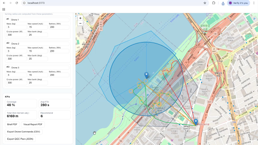
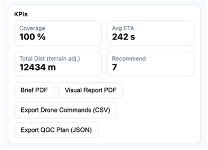
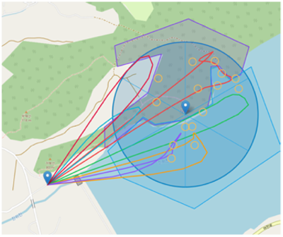

# AeroRescue — Mission Validation & Risk Intelligence System  
**Mission Risk, Regulatory Compliance, and Decision Validation for Autonomous Aerial Operations**

---

## Overview
This repository presents a **mission-level validation system** for autonomous drone operations operating under regulatory, safety, and environmental constraints.

Rather than focusing on low-level flight control or perception, this project models how **missions remain legally valid, operationally safe, and decision-stable** when exposed to:
- Regulatory boundaries (No-Fly Zones, restricted airspace)
- Environmental risk (coverage loss, energy margins)
- Communication and execution uncertainty

The system frames autonomous flight as a **quality-managed process**, where mission feasibility, risk exposure, and post-mission traceability are treated as first-class engineering artifacts.

---

## Engineering Context
In real-world deployment, an autonomous system can be technically capable of flying while being **operationally invalid** due to regulatory or safety constraints.

This project treats:
- **Flight path → Process flow**  
- **NFZ / Airspace rules → Regulatory constraints**  
- **Mission abort / reroute → Deviation handling**  
- **Post-mission review → CAPA-style validation loop**

This mirrors quality and validation frameworks used in regulated manufacturing and safety-critical automation.

---

## System Architecture

### Mission Flow
MISSION PLAN → CONSTRAINT CHECK → RISK SCORING → EXECUTION → REVIEW / CORRECT

### Validation & Intelligence Layer
- **Regulatory Risk Engine**  
  Airspace and NFZ intersection analysis
- **Mission Health Metrics**  
  Energy margin, coverage loss, communication reliability
- **Deviation Detection**  
  Threshold-based risk escalation
- **Post-Mission Report Generator**  
  Root cause, containment, and preventive recommendations

---

## Experimental Scenarios

### Scenario 1 — Baseline
- Nominal urban environment
- Objective: establish reference mission feasibility and risk exposure

### Scenario 2 — Regulatory Disturbance
- Expanded No-Fly Zones and airspace restrictions
- Objective: observe constraint-driven rerouting and feasibility loss

### Scenario 3 — Communication / Energy Stress
- Reduced communication reliability or energy margin
- Objective: validate abort and corrective decision logic

---

## Risk Metrics

| Metric | Description | Engineering Interpretation |
|--------|--------------|-----------------------------|
| **NFZ Hit Count** | Number of path intersections with restricted zones | Regulatory exposure |
| **Risk Score** | Weighted composite of legal, safety, and energy risks | Deviation trigger |
| **Energy Margin (%)** | Remaining energy vs mission requirement | Execution feasibility |
| **Coverage Loss (%)** | Mission objective shortfall | Operational effectiveness |

---

## Results Summary (Representative)

| Scenario | Feasible | Risk Score | Deviation Triggered | System Response |
|----------|-----------|--------------|------------------------|------------------|
| Baseline | Yes | Low | No | Mission accepted |
| Regulatory Disturbance | Partial | High | Yes | Reroute / Abort |
| Energy Stress | No | Critical | Yes | Mission rejected |

---

## Figures
<p align="center">
  
  
</p>

<p align="center">
  
</p>

---

## Engineering Interpretation
This system demonstrates that **autonomous missions require validation beyond control and perception performance**.

By framing mission execution as a regulated process:
- Risk is treated as a **measurable, traceable signal**
- Deviations trigger **structured corrective action**
- System behavior remains interpretable to operators, regulators, and stakeholders

This architecture aligns autonomous decision-making with quality and compliance workflows used in manufacturing, aviation, and safety-critical industries.

---

## Repository Structure
figures/ → Maps, dashboards, and report visuals
results/ → Scenario metrics and logs
reports/ → Post-mission validation reports
src/ → Simulation and analysis code


---

## How to Run
```bash
# Run mission scenarios
python src/run_missions.py

# Generate validation dashboard
python src/analysis.py

# Create post-mission report
python src/mission_report.py
```
## Related Work

- Manufacturing Quality System:
https://github.com/anna-jaekyung-lee/manufacturing_simulator

- Decision Stability Validation:
https://github.com/anna-jaekyung-lee/hamsterbot-decision-stability-validation

## Author

**Jaekyung Lee**

Department of Mechanical Engineering, Yonsei University

Email: jjjlldk@gmail.com

## License

Released for academic and portfolio use.

Commercial deployment requires explicit permission.
